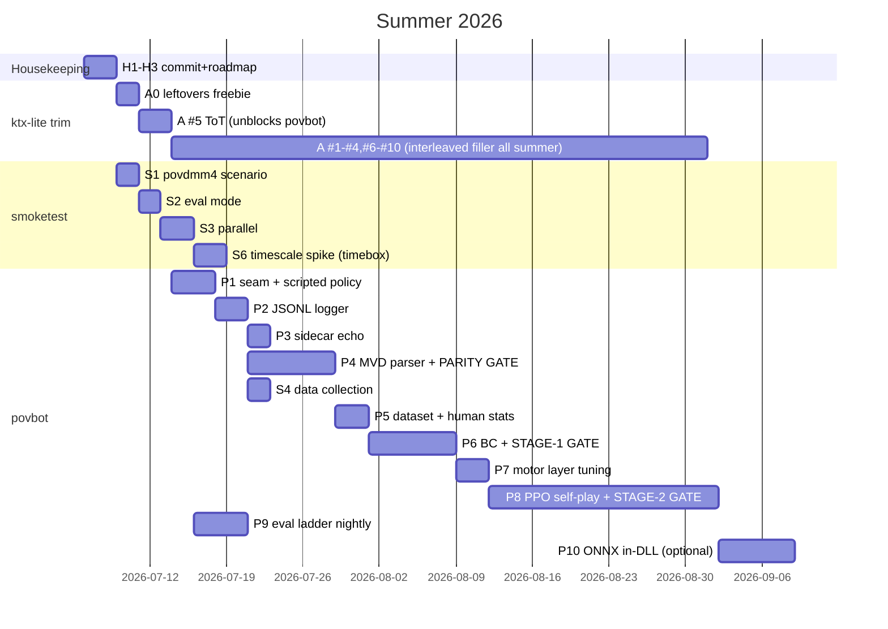

# ktx-lite Summer Roadmap — lite mod, povbot, smoketest

## Context

Three interlocking projects on the fork `riovv/ktx`, branch `ktx-lite` (`E:\dev\ktx-lite\ktx`), to be executed over summer 2026 by the owner plus weaker AI models working from this document. Each work item is deliberately small, has explicit acceptance criteria, and is gated by the smoketest so a less-capable executor can verify their own work.

1. **ktx-lite** — continue slimming the KTX QuakeWorld server mod. Game modes are already cut (CTF, race, runes, grapple, RA, CA/Wipeout, HoonyMode, VIP/coach, hiprot, XML stats, QVM). Next: remove *fat* — fringe rulesets, legacy client compat, and settings bloat. This doc contains the ranked candidate list with per-feature evidence.
2. **povbot** — a new ML bot for 1v1 duels on povdmm4, built on the frogbot shell, in the spirit of OpenAI's Dota 2 1v1-mid bot: an isolated, tiny environment; self-play RL; but explicitly **anchored to human play** learned from the owner's own MVD demo collection. Hard requirement: not an aimbot — human-emulating aim/reaction with tunable accuracy; the interesting part is learned *play*: movement, weapon choice, pre-firing spawns, positioning after kills, reacting to top/bottom spawns.
3. **smoketest** — the existing headless test harness (built July 2026) grows into (a) the regression gate for every fat-trim commit, and (b) the match runner / data factory / eval ladder for povbot.

**Decisions already made with the owner:** povbot runtime is **two-phase** — Phase A: Python "brain" sidecar over a local UDP bridge (training + early play); Phase B (later, optional): export policy to ONNX, embed inference in `qwprogs.dll` for standalone deployment. Demo corpus: **owner's own collection** of povdmm4 duel MVDs. Hardware: **local Windows PC with NVIDIA GPU**, PyTorch+CUDA.

**First implementation action of this plan: copy this document into the repo as `docs/ROADMAP.md`** so it is versioned and available to every future session, then commit the currently-uncommitted working tree (see §0).

---

## 0. Current state & immediate housekeeping (Week 1, Day 1)

As of 2026-07-06 the working tree has **uncommitted** work that everything else builds on:

- `src/g_main.c`, `src/g_cmd.c` — `ConsoleCommand()` dispatcher: server-console/rcon `mod addbot [skill] [team] [force] | removebots | status | errortest`. This is the enabler for headless bot control.
- `src/bot_commands.c` — `FrogbotsRemoveAllBots()`, fixed `self` deref in `FrogbotsAddbot` (printed caller's skill, crashed from console context).
- `src/commands.c` — fixed `um_list[]` too-many-initializers build break (leftover from race removal).
- `include/fb_globals.h`, `.gitignore` — declarations, ignore rules.
- `smoketest/` — the entire v1 harness (see §3 for its verified capabilities and quirks).

**Tasks:**
- [ ] `H1` — Commit the above as 2 commits: (1) "Add server-console mod command dispatcher (addbot/removebots/status/errortest)" including the bot_commands/fb_globals/commands.c fixes; (2) "Add smoketest: headless bot-driven runtime harness" (smoketest/ + .gitignore). Push to `origin/ktx-lite`.
- [ ] `H2` — Copy this document to `docs/ROADMAP.md`, commit. Keep it updated: when a task completes, check its box and note the commit hash.
- [ ] `H3` — Build note: MinGW is gone from this machine; the working toolchain is VS 2022 Build Tools via `cmake -S . -B build_msvc -G "Visual Studio 17 2022" -A x64` + `cmake --build build_msvc --config Release`. Add this to `docs/ROADMAP.md` or README so future sessions don't rediscover it.

---

## 1. Workstream A — ktx-lite fat trim

### Method (apply to every removal, one feature per commit)

1. Run `node smoketest/run.js` — must be green before starting.
2. Remove: cvar registrations (`src/world.c` `FirstFrame`), command-table entries (`src/commands.c` `cmds[]` at ~line 580–885), the implementation call-sites, any per-player struct fields (`include/progs.h`) and stats-table columns they feed, and mentions in `resources/example-configs/`.
3. Build (`cmake --build build_msvc --config Release`) with zero new warnings.
4. Run full smoketest again — green. For removals touching combat/physics (yawnmode, midair, instagib, LGC) also eyeball one `results/<ts>/duel-dm4/qconsole.log` and the demo dir for sanity.
5. Commit with a message naming the feature, its cvars, and the line delta.

Evidence base: ~259 registered cvars total (~216 in `src/world.c:637–930`, ~40 frogbot in `src/bot_botimp.c:113–153`); command table ~267 entries; `src/` totals 75,927 lines of which `commands.c` alone is 8,783.

### Freebie (do first): leftovers from already-removed modes

Zero risk, pure cleanup:
- [x] `A0` — Remove `k_rocketarena` (world.c:819), `k_clan_arena`, `k_clan_arena_rounds`, `k_clan_arena_max_respawns` (world.c:823–825), `k_vp_hookstyle` (world.c:713) registrations and any remaining reads; `umCtf` from `UserModes_t` (g_local.h:178); "ctf" from `ListGameModes` (commands.c:~8756); `k_ctf_*` block from `resources/example-configs/ktx/ktx.cfg`; the `ctf/` usermode config dir and `id1/maps/ctf/` ent dir from example-configs; `race/` dir from example-configs/ktx. **Done** (`1676dfd`). Smoketest green before/after, build clean. What surprised us: `k_clan_arena`'s RegisterCvar was already gone from the mode-toggle command in the earlier Clan Arena cut, but 4 raw `cvar("k_clan_arena")` reads survived in client.c's spawn-point logic (dead branches, since the cvar could no longer be set to 2) — removed those too. Also found and removed extra CTF leftovers the ranked list didn't name: a dead `streq(um,"ctf")` bot-block check and a dead `isTeam()`/else-ctf demo-naming branch in commands.c/match.c, plus `configs/usermodes/matchless/ctf.cfg`. Verified the `k_ctf_rune_power_*` cvars (still read by bot_aim.c/bot_botweap.c/bot_botstat.c for rune multipliers) are genuinely dead too — `ctf_flag` is only ever reset to 0, never OR'd with a rune bit anywhere — so deleting the whole `k_ctf_*` ktx.cfg block is safe. Left `CTF_RUNE_*` defines/`ctf_flag` field alone (progs.h comment says explicitly "kept for bot code").

### The 10 ranked removal candidates

Ranked by (lines-and-complexity recovered) ÷ (risk of breaking kept modes). Footprints were grep-verified 2026-07-06.

| # | Feature | What it is | Footprint | Risk notes |
|---|---------|-----------|-----------|-----------|
| 1 | **Instagib** (`k_instagib`, `k_instagib_custom_models`, `k_cg_kb`) | Railgun-only alternate mode — really a *game mode* that survived the first pass | **67 hits / 11 files** (weapons.c, combat.c, items.c, client.c, match.c, stats_json.c); `ToggleInstagib` commands.c:7036, `ToggleCGKickback` :7197; cmds `instagib`, `instagib_coilgun_kickback` | Self-contained toggle branches; removes a stats_json section too. Synergy: simplifies `maps_map_povdmm4.c` desire logic. |
| 2 | **Midair** (`k_midair`, `k_midair_minheight`) | Rockets-only-count-in-midair mode | **59 hits / 14 files**; `ToggleMidair` commands.c:6839; midair stats in stats.c/stats_json.c:526 | Same shape as instagib. Also referenced in `maps_map_povdmm4.c` — removal simplifies povbot's map. |
| 3 | **LGC mode** (`k_lgcmode`) | LG-training mode with distance-bucketed hit tracking | **~74 hits**; `ToggleLGC` commands.c:7153, `lgc_*` handlers :8661–8740; call-sites combat.c:251, player.c:430/463, weapons.c:1110/1129; per-player `lgc_distance_hits/misses`, `lgc_state` in progs.h **and stats tables + stats_json.c:569** | Touches per-player struct + stats schema — do carefully, but very contained semantically. Also forces overtime off in match.c:485-491 (branch simplifies). |
| 4 | **Yawnmode** (`k_yawnmode`, `k_teleport_cap`) | Alternate damage/armor/physics ruleset | **41 hits / 14 files** — branches inside weapons.c (7+), items.c (6), player.c, match.c, triggers.c, misc.c, admin.c:880; `ToggleYawnMode` commands.c:7945 | Most *pervasive* candidate — every removal deletes an if-branch in core combat math. Highest cleanliness payoff; test combat carefully after. |
| 5 | ~~**ToT mode** (`k_tot_mode`)~~ **DONE** (`<pending>`) | "Tribe of Tjernobyl" special FFA variant | `ToggleToT` commands.c:7224, `tot_mode_enabled()` :8780; gates in bot_botimp.c:409, bot_client.c:155, bot_commands.c:135/329/2302, bot_botweap.c:956, client.c:1830/3582/3608, combat.c:467-469, items.c:2161/2420, match.c:1481, player.c:1063; `tot` entry in `um_list[]` | Deeply frogbot-entangled — removing it *simplifies bot code before povbot work begins*. Do before povbot Phase P1. What surprised us: the ranked-list footprint (grepped for literal "tot"/"ToggleToT") missed a second, deeper layer — three frogbot tuning knobs (item pickup bonus, quad damage multiplier, break-on-death) had their own cvars/admin commands but their *only* real consumption sites were gated behind `tot_mode_enabled()` in items.c (~11 sites), match.c (~4), combat.c (1). Confirmed with the owner these were ToT-exclusive and removed them entirely rather than leaving orphaned always-false toggles. Also found the `"tot"` numeric usermode-switch command (commands.c, value 12) was already dead before this removal — an off-by-one against `um_cnt` meant `/tot` could never actually dispatch; only `/totmode` (ToggleToT) ever worked. And an extra example-config leftover the list didn't name: `configs/usermodes/tot/` (dm4.cfg, e1m2.cfg, schloss.cfg). |
| 6 | **3-team usermodes** (2on2on2/3on3on3/4on4on4) | Three-team variants beyond kept modes | `um_list[]` entries commands.c:4099–4101, init strings :3935–4089, enums g_local.h:179–181, special team logic commands.c:3190–3199/6224–6261, cmds :692–701 | Kept modes are duel/team/FFA — 3-team is fringe. Keep `XonX`. Straightforward table/enum surgery. |
| 7 | **Freshteams / dmm1 sweep** (`k_freshteams*`, `k_nosweep`, ~15 cvars) | dmm1 weapon-respawn tweaks for team games | world.c:767–782; items.c + commands.c:812–816 (`fresh*`, `nosweep` cmds) | Niche 4on4-dmm1 culture feature; confirm owner doesn't run dmm1 team games first. |
| 8 | **Qizmo/fpd legacy compat** | Proxy-era client restrictions (skin/color force, pitch/yaw speed limits, %-reporting bits) | `ShowQizmo` commands.c:1407; fpd bit-toggles :2985/3377–3482; ~15 manipulation sites incl. match.c:308/1201; cmds `qizmo,qlag,qenemy,qpoint,skinforce,colorforce,pitchsl,yawsl` (~8) | Qizmo is a 1990s proxy. Keep the bare `serverinfo fpd` default in configs; delete the toggle machinery. |
| 9 | **Timing/lagged-player manipulation + kickfake** (`allow_timing`, `timing_players_time/action`) | Marks lagging players glow/invincible; `$\`-fake-message policing | client.c:130–190 (PostThink loop), :2686–2695; kickfake sites g_cmd.c:493/499/673/781/857 | Engine `sv_unfake` already handles fake messages; lag manipulation is a LAN-era artifact. Small but crufty. |
| 10 | **Small-fry bundle** (one commit each, all tiny): Berzerk (`k_bzk`,`k_btime`, 9 hits, ToggleBerzerk commands.c:2973) · spec wizard (`allow_spec_wizard`, `k_no_wizard_animation`, spectate.c:44) · "trix" movement recorder (`mv_record`/`plrfrm_t`, commands.c:7561–7660, g_main.c:81/208, progs.h:262–274, cmds `trx_rec/play/stop` — **but first copy its struct pattern into the povbot logger, §2 P2**) · spectator favorites (cmds `fav_add/del/all_del/next/show,next_best,next_pow`, commands.c:761–772) | | | |

**Deliberately NOT candidates (decide-with-owner list, revisit in August):** captains/elections (`captain.c` 420 lines — pickup-game culture may want it), full voting system (`vote.c` 1,455 lines — but `k_vp_hookstyle`+`k_vp_coop` style orphans can go piecemeal), handicap (28 hits — some legitimate duel use), private games (5 cvars, vote.c:1097–1264 — useful for a members-only server), MOTD (small and useful), wreg (commands.c:6603 — some clients still use it), idlebot/practice mode (server-operator QoL), demo-marks + lastscores (spectator QoL), `sp_*.c` monster AI (13.6k lines — required by kept coop/bloodfest), teamplay .loc files (used by kept team modes).

**Acceptance for Workstream A overall:** ≥10 removal commits, each individually smoketest-green; `src/` line count reduced by a further ~3–5k; `RegisterCvar` count reduced by ≥40; a final commit updating `resources/example-configs/ktx/ktx.cfg` to only mention surviving cvars.

---

## 2. Workstream B — povbot

### 2.1 Architecture (verified against source 2026-07-06)

**Key insight:** ktx-lite already removed the QVM build — `qwprogs.dll` is a **native DLL**, so the mod can open a plain localhost UDP socket (winsock) to a Python sidecar directly. No engine changes, no syscall-table constraints.

**The seam.** Frogbot's frame flow (all under `#ifdef BOT_SUPPORT`): the engine calls the mod's `GAME_START_FRAME` twice per server frame (`src/g_main.c:167–192`) — bot pass (`BotStartFrame`, `src/bot_commands.c:2674`) then game pass. Per bot per frame: decision functions write to the per-entity `self->fb` fields, then `BotSetCommand` (`src/bot_movement.c:425–578`) assembles and delivers the command via `trap_SetBotCMD(entity, msec, angles, fwd/side/up, buttons, impulse)` (`src/g_syscalls.c:417`). The complete brain-output contract is just these `self->fb` fields, written before `BotSetCommand` runs:

- `dir_move_` (move wish-direction; goes through `ApplyPhysics` strafe-accel physics)
- `desired_angle` (view target)
- `jumping`, `firing`
- `desired_weapon_impulse` / `next_impulse` + `botchose`

povbot **keeps frogbot's actuator layer** (`BotSetCommand`, `ApplyPhysics`, `BotCanRocketJump`, `AvoidHazards`) and **replaces the decision layer** (`BotsFireLogic` src/bot_aim.c:471, `TargetEnemyLogic` src/bot_botthink.c:106, `UpdateGoal` src/bot_botgoals.c:334, `BotMoveTowardsLinkedMarker`→`SetDirectionMove` step) for entities flagged as externally-driven.

**Implementation shape:** new file `src/povbot.c` (+ `include/povbot.h`), added to `CMakeLists.txt`:
- `qbool external_brain` flag added to `fb_entvars_t` (`include/progs.h:524–743`). In `BotStartFrame`'s per-bot loop, if set: skip frogbot decision calls, call `PovbotFrame(self)` instead, still fall through to `BotSetCommand`.
- **UDP bridge**: non-blocking winsock socket to `127.0.0.1:<port>`; each *decision tick* send a packed observation struct, poll for the latest action; if none arrived, reuse last action (the design tolerates this). Versioned 4-byte magic + schema version in the packet header — the Python side asserts it, preventing silent featurizer skew.
- **Motor layer** (in C, runs at 77 Hz between 19 Hz decisions): slew view angles toward the policy's target with an angular-velocity cap (~600°/s yaw, 400°/s pitch); apply frogbot's existing parametric aim-error model (`BotsModifyAimAtPlayerLogic` + `CalculateVolatility`, `src/bot_aim.c:233–377`) to fire-time aim. Aim-error magnitude and reaction delay are THE two skill knobs, and they're **frozen during RL** so the policy learns to compensate for its own human-like motor system.
- **Reaction delay**: featurizer ring-buffers enemy/projectile/sound features and serves them delayed ~200 ms (per-episode τ ~ N(200ms, 40ms), min 120ms). Self-features undelayed. The policy physically cannot see fresh enemy data.
- Enabled via cvar `k_povbot_port` + console command `mod povbot <n>` (extends the existing `ConsoleCommand()` dispatcher).
- **Gotcha found in source:** `ApplyPhysics` early-returns for `deathmatch>=4 && isDuel && !wiggle_run_dmm4` (`src/bot_movement.c:141–144`) — dmm4 frogbots wiggle-strafe instead of full strafe routing. povbot must set/bypass this (`FB_CVAR` wiggle_run_dmm4 or a povbot-specific branch) so the move head gets real strafe physics.

**The environment.** povdmm4: `deathmatch 4` (spawn with all weapons + full ammo, no pickups/respawns except one yellow armor behind a door), `timelimit 3`, `k_overtime 2` (config: `resources/example-configs/ktx/configs/usermodes/povdmm4.cfg`). 23 explicit waypoint markers from `resources/example-configs/ktx/bots/maps/povdmm4.bot` (+10 dynamic). Existing per-map hook `POVDMM4DontWalkThroughDoor` (`src/maps_map_povdmm4.c`). This is a genuinely OpenAI-1v1-shaped problem: tiny state space, one map, one matchup, skill = timing/positioning/aim-tradeoffs.

### 2.2 ML design

**Observation (~168 floats, normalized ±1):** hybrid frame — absolute map-frame self-position (tiny fixed map; the net memorizes geometry like humans do; z tells the level) + egocentric yaw-rotated vectors for everything dynamic. Groups: self kinematics+HP/armor (14); weapons/ammo/cooldown (17); enemy when-visible w/ visibility mask (18); enemy memory: last-seen pos/vel + time-since-seen (8); 4 nearest projectiles (32); 3 recent sound events typed+directional (18); **spawn block — the povdmm4 core: enemy-alive, time-since-enemy-death, spawn-imminent flag, per-spawn-point my-distance + my-LOS (16)**; door/YA state (5); clock + frag diff + overtime (6); previous action one-hots (34).

**Action (all-discrete multi-head, ~34 logits), decision rate 19.25 Hz** (every 4th server frame — makes UDP RTT irrelevant, quarters rollout cost, motor layer supplies 77 Hz smoothness):
- Move: 9-way (8 compass in yaw frame + none) → frogbot `ApplyPhysics`
- Yaw delta: 13 bins {0, ±1°, ±3°, ±7°, ±15°, ±35°, ±75°}; Pitch delta: 9 bins {0, ±1°, ±3°, ±10°, ±30°}
- Jump: 2; Attack: 2; Weapon: 9 (impulse 1–8 + no-change)

**Network:** MLP encoder 168→512→256 (LayerNorm, ReLU) → **LSTM 256** → 6 policy heads + value head. **~1.2M params.** Recurrence is required: enemy is invisible most of the time on a two-level map; spawn clocks and delayed observations need memory. Value head gets undelayed true enemy state appended during training only (asymmetric critic — standard, big variance reduction, unused at play time).

**Training pipeline & go/no-go gates:**

- **Stage 0 — data plumbing (2 wks).** Adapt a community MVD parser (start: QW-Group `mvdparser`) → per-frame JSONL identical in schema to the mod's live logger (P2 below). Reconstruct actions from MVD: angles from state deltas, buttons from attack/muzzle events, movedir by inverting QW acceleration from velocity deltas. **Gate — the parity test:** record one frogbot match with BOTH the live JSONL logger and MVD; parsed-MVD features must match live features within tolerance, and reconstructed actions vs ground-truth bot commands: ≥90% move-dir agreement, <2° angle error. If action reconstruction fails → documented fallback (BC on state-deltas via actuator, or inverse-dynamics model trained on frogbot logs) — decided HERE, not in week 6. Also in Stage 0: log 500 frogbot-vs-frogbot povdmm4 matches overnight (free BC-pretrain data), and compute the human-reference statistics (LG%, RL direct%, reaction-time distribution, angular-velocity distribution, movement-speed distribution) from the owner's demo corpus — these become the §2.3 likeness gates.
- **Stage 1 — behavior cloning (2 wks).** ~100 human matches ≈ 700k decision steps for a 1.2M-param net — thin but workable; if corpus is smaller, pretrain on frogbot logs, fine-tune on human. Truncated BPTT seq-len 64 (~3.3 s); weapon/attack heads upweighted 3×; mirror-augment only after verifying povdmm4's symmetry. **Gate (live behavior, not held-out accuracy):** deployed BC bot survives 3-min matches without suicide >90%; ≥30% of frags vs frogbot skill 10; eyeball: pre-fires spawn areas, contests YA.
- **Stage 2 — self-play PPO with KL-to-BC anchor (4–6 wks, the bulk).** Recurrent PPO (sample-factory or CleanRL recurrent). Opponent pool: 80% current self, 20% uniform past checkpoints (saved ~2-hourly) — cheap league-lite against strategy cycling. Loss: PPO + β·KL(π‖π_BC), β≈0.5, adjusted by a controller keyed to the likeness metrics — **the anchor is a hard requirement, never dropped for winrate**. Throughput at realtime: 40 parallel servers × 2 agents × 19.25 Hz ≈ 1,540 steps/s ≈ ~100M steps/day; expect 0.3–1B steps → **3–10 days wall-clock at 40 servers**. One Python sidecar serves all agents with batched GPU inference. **Gate:** ≥65% winrate vs BC checkpoint AND ≥60% vs frogbot max skill AND all likeness gates pass. A checkpoint failing likeness is not promoted regardless of winrate.
- **Stage 3 — league (contingency only).** Trigger: non-transitive cycling in the eval ladder. Budget zero weeks; on a one-arena all-weapons map the checkpoint pool should suffice. (DAgger: skipped — PPO+KL-anchor dominates it here.)

**Reward:** terminal ±1 per frag (zero-sum; suicide = conceded); shaping +dmg_dealt/100 −dmg_taken/100 annealed to 0 over first 200M steps; +0.15 YA pickup annealed out; **no spawn-frag bonus** (already the highest-value action; a bonus invites spawn-camping degenerate). **Style comes from the KL anchor, not reward terms.** Failure modes to monitor: stand-still-to-shoot exploit (volatility model penalizes movement → watch speed distribution), door camping (heatmaps vs human), damage farming (anneal + per-frag-cycle cap), rocket-only collapse (weapon-usage distribution; human LG share ≈20–40% close-range).

### 2.3 Evaluation protocol (nightly, automated via smoketest)

- **Ladder:** 50 matches each vs frogbot at 3 skills, vs BC checkpoint, vs 3 past selves; TrueSkill/BayesElo over the pool; Elo-vs-steps plot.
- **Human-likeness gates** (from eval MVDs, reference values from Stage 0): LG hit% and RL direct% within [human p25, p90]; reaction-time median within ±50 ms of human median; angular-velocity distribution Wasserstein-1 distance < 2× the BC-vs-human distance; movement-speed and jump-rate distributions same test.
- **Stretch:** small GRU discriminator (human vs bot on 5 s windows); promotion requires AUC < 0.70.
- **Monthly:** owner plays 5 matches, subjective 1–5 "felt human" score (ground truth, not a gate).

### 2.4 Risk kill-tests (all in Weeks 1–3, each ≤3 days)

1. **MVD action reconstruction** (highest risk) → Stage 0 parity test. Fallback pre-decided.
2. **Realtime throughput** → 40 headless servers + random-action sidecar for 1 h; measure steps/s, CPU, UDP deadline-miss rate. Plus a **timeboxed 3-day spike**: MVDSV timescale patch (physics is msec-parameterized; 2–4× may just work — MVDSV is open source and we build it). Success halves Stage 2; failure costs 3 days.
3. **Demo corpus sufficiency** → BC learning curve at 25/50/100% of demos; if still climbing at 100%, activate frogbot-pretrain and solicit community demos in July, not August.
4. **UDP RTT** → largely defused by the 52 ms decision window; if miss-rate >5% under load, escape hatch is in-DLL ONNX Runtime inference (which is Phase B anyway).
5. **KL anchor actually holds style** → week-5 24 h PPO at β ∈ {0, 0.5, 2.0}, compare likeness stats.
6. **Featurizer train/serve skew** → killed by the parity test; that's why Stage 0 is its own gated milestone.

### 2.5 povbot task list

Repo layout: C side in `src/povbot.c`; Python side in `povbot/` at repo root (`povbot/parse/` MVD→JSONL, `povbot/train/` BC+PPO, `povbot/serve/` UDP sidecar, `povbot/eval/` ladder + likeness stats, `povbot/data/` gitignored).

- [x] `P0` — Remove ToT mode first (Workstream A #5) — it's tangled through the exact bot files povbot touches. **Done** (`<pending>`).
- [ ] `P1` — `src/povbot.c` skeleton: `external_brain` flag in `fb_entvars_t`; `BotStartFrame` branch; UDP socket (non-blocking, versioned packet header); a **scripted test-policy in C** (aim at enemy, hold attack, walk forward) proving the seam works with zero Python. Acceptance: `mod povbot 1` on a povdmm4 smoketest scenario shows the povbot moving/firing in a recorded MVD.
- [ ] `P2` — Per-frame JSONL logger in the mod (`k_povlog 1`): per player per frame: origin, velocity, angles, health, armor, weapon, ammo, buttons-equivalent, fired/hit events (hook `PlayerPostThink` client.c:3961 — it already computes speed at :4029–4037; damage events via `T_Damage` combat.c:422). Write via the `S2di`-style 1024-byte writer (stats.c:370), NOT `std_fprintf` (128-byte truncating buffer, files.c:2). Binary-append mode exists (`FS_APPEND_BIN`, g_public.h:230–236). Acceptance: a povdmm4 frogbot match produces a parseable JSONL with no truncated lines.
- [ ] `P3` — Python sidecar echo test: sidecar receives observations, returns scripted actions; povbot in-game behavior matches P1's C-scripted policy. Acceptance: identical behavior, <5% action-deadline misses.
- [ ] `P4` — MVD parser: adapt community parser → JSONL matching P2 schema; action reconstruction. Acceptance: **Stage 0 parity gate**.
- [ ] `P5` — Dataset builder + human-reference statistics from owner's corpus.
- [ ] `P6` — BC training + deployment via sidecar. Acceptance: **Stage 1 gate**.
- [ ] `P7` — Motor layer finalization: slew caps + frogbot error model wiring + reaction-delay ring buffer; tune the two knobs so BC bot's measured accuracy/reaction stats sit inside the human reference band.
- [ ] `P8` — PPO self-play infra: parallel-server orchestration (§3 S3), batched sidecar, checkpoint pool, KL anchor. Acceptance: **Stage 2 gate**.
- [ ] `P9` — Eval ladder + likeness stats automation (§3 S5). Nightly run artifact: one JSON + one plot.
- [ ] `P10` (Phase B, optional, late summer) — ONNX export + in-DLL inference (ONNX Runtime C API), so povbot ships as a plain mod without Python. Acceptance: identical eval-ladder Elo ±25 vs sidecar version.

---

## 3. Workstream C — smoketest evolution

Current verified state (see `smoketest/README.md` for full detail): Node, zero deps; scenarios boot fresh `mvdsv.exe -game ktx +exec smoketest.cfg +logfile +map <x>` per scenario on port 27600; drives everything via UDP rcon; **detection = rcon-responsiveness polling** (a mod `G_Error` leaves the process alive but permanently rcon-dead — verified) plus process-exit as secondary; `errortest` scenario is a permanent self-test of the detector; a deliberate-crash drill validated the process-exit path. Known quirks (documented in README): mod-printed text is invisible to rcon replies (only engine-native command output comes back — `status` works, `mod status` doesn't); bot map-support detection races a one-shot frame-20 check (worked around: `deathmatch 1` in smoketest.cfg + `force` on every addbot); an empty server gets map-reset to `k_defmap` by `Spawn_DefMapChecker` (world.c:130).

- [ ] `S1` — **povdmm4 duel scenario**: `exec configs/usermodes/1on1/default.cfg`, then povdmm4 cfg pattern (`deathmatch 4`, `timelimit 3`, `k_overtime 2`), 2 bots skill 10 force, mode "match". Also copy `povdmm4.bot` handling note: the .bot file is already in the sandbox via example-configs. Acceptance: green run; MVD demo appears in `sandbox/ktx/demos/` (set `demo_tmp_record 1` in the scenario setup).
- [ ] `S2` — **Eval mode**: new scenario mode `"eval"` — after the match window, parse the frags column from the rcon `status` reply (`lib/rcon.js` `statusConnectedLines`; verified format: name/ping/frags columns) and write `{players:[{name,frags}], winner}` into `verdict.json`. Add `--matches N` to repeat a scenario and aggregate. Acceptance: 5-match frogbot-vs-frogbot povdmm4 run produces a winner table.
- [ ] `S3` — **Parallel instances**: `lib/server.js` takes a port per instance (it already does); add a `run-parallel.js` (or `--parallel K` flag) that runs K scenario instances on ports 27600+i concurrently with per-instance sandboxes-or-shared-sandbox (shared ktx/ dir is fine — server writes are per-port demo/log names; verify qconsole log name collision: it's `qconsole_<port>_*.log`, already port-scoped). Acceptance: 10 parallel povdmm4 matches complete green; this is the rollout backbone for P8 and kill-test 2.
- [ ] `S4` — **Data-collection scenario type**: scenario flag `povlog: true` sets `k_povlog 1` (after P2 exists) and sweeps the JSONL + MVD into `results/<ts>/<scenario>/`. Acceptance: overnight batch of 500 frogbot matches yields 500 JSONL+MVD pairs (Stage 0 data).
- [ ] `S5` — **Ladder runner**: `povbot/eval/ladder.js` (or Python) composes S2+S3: given two "agent specs" (frogbot-skill-N | sidecar-checkpoint-path), run M matches, output TrueSkill updates + likeness stats extraction from MVDs. Acceptance: nightly artifact for §2.3.
- [ ] `S6` — **Timescale spike** (timeboxed 3 days, kill-test 2): clone QW-Group/mvdsv, attempt an `sv_timescale`-style patch, measure whether 2–4× compressed matches still verify parity (bot behavior statistically unchanged). Success → wire a `timescale` scenario option; failure → document and move on.
- [ ] `S7` — Keep smoketest as the fat-trim gate throughout (already its job). When a trim removes a feature the smoketest exercised, update scenarios in the same commit.

---

## 4. Sequencing

Dependency spine: **H1 → A0 → A#5(ToT) → P1 → P2 → {P3, P4, S4} → P5 → P6 → P7 → P8**, with smoketest S1–S3 and the remaining trims as parallel/filler work whenever the ML side is blocked on training wall-clock.

---

## 5. How to execute this with lesser models

- **One roadmap item per session.** Open the session with: the item ID (e.g. "P4"), its acceptance criteria pasted verbatim, and "read docs/ROADMAP.md §<n> first".
- **The smoketest is the trust anchor.** Any change to `src/` requires a green `node smoketest/run.js` before commit — no exceptions, and `errortest` staying green proves the detector itself still works.
- **Never mix workstreams in one commit.** Trim commits touch only the feature being removed; povbot commits never touch trim targets.
- **Gates are hard.** If a Stage gate fails, the next session's task is diagnosing the gate — not proceeding.
- **Update the roadmap.** Completing an item = check its box + commit hash + one line of "what surprised us" (this file already carries several hard-won empirical corrections — that's the pattern).
- **Build command** (this machine): `cmake --build build_msvc --config Release`. If `build_msvc/` is missing: `cmake -S . -B build_msvc -G "Visual Studio 17 2022" -A x64`.
- **When stuck on QW arcana**, the reference points: frogbot act-contract = `trap_SetBotCMD` (g_syscalls.c:417); brain-output fields = progs.h:640–655; demo recording = match.c:1911 `StartDemoRecord`; per-frame hook = client.c:3961 `PlayerPostThink`; damage hub = combat.c:422 `T_Damage`.

## 6. Verification (plan-level)

- Workstream A: after each removal — full smoketest green + build clean; end state — ≥10 removals committed, example configs updated.
- Workstream B: the four gates (parity, BC-live, Stage-2 winrate+likeness, ladder) each produce a scriptable pass/fail artifact in `results/`.
- Workstream C: S1–S5 each have a one-command acceptance run stated above; S3's 10-parallel green run doubles as povbot kill-test 2.
